Configurations
==============

When clicking the “configurations” tab you are faced with a choice:

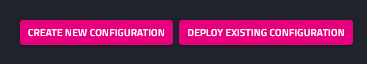

But wait, what is a configuration?!

Let's click on “create new configuration” to understand.
First, type a name and push the submit button.

.. image:: _static/img/media/image43.png
    :width: 3.20833in
    :height: 1.5in

Now, we are in the component editor tab. Our configuration is empty.

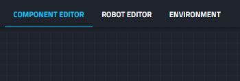

Adding a component
------------------

Let’s click on the + button to add a new component.

A component is a block which represents some dockerized process.
These dockers may contain a driver for some device, for instance, a
camera driver, or some algorithm such as SLAM or object recognition.
Since these components are dockerized they contain all the necessary
dependencies, e.g., OS libraries, ROS1/ ROS2 project, native code
etc. As such, it is easy to deploy them on the robot and compose a
behavioral graph where the streams from some sensor driver components
(e.g., camera, odometry, laser scan) serve as the input for some
algorithmic components (e.g., object detection, Nav2, Move base)
which in turn, pass streams to other algorithmic components, until
commands are sent through the driver components which in turn,
manipulate the robot, closing the sense-think-act cycle.

Now we can understand the window that is opened.

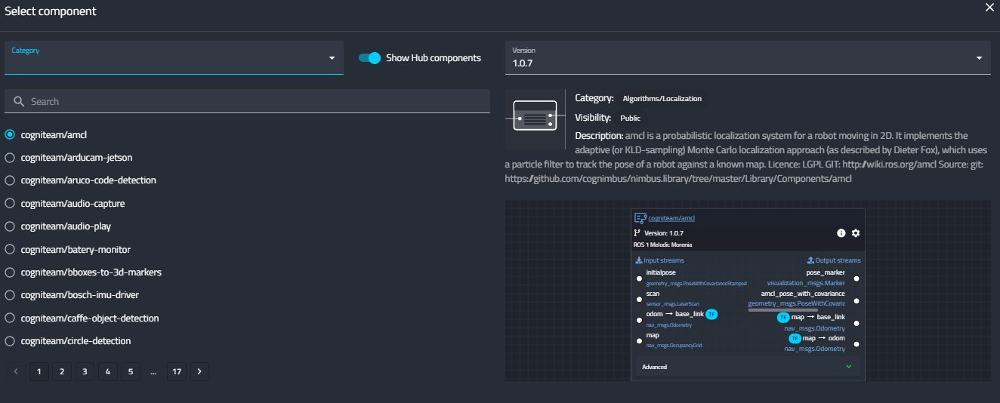

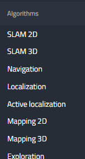

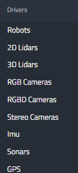

The Cogniteam Cloud Platform has a HUB filled with many ready to use components. So to choose an existing one we must filter our search. Let’s choose a category from the drop down menu. As you can see, there are many categories of algorithms and drivers. 
After narrowing down the list, we can select a desired component, and see its description on the right side. 
For instance, the following image describes a Mapping 3D algorithm. You can see its current version, the category, its visibility (public / private), a short description, and a link to the open-source project in GIT. Below, you can see the graphic representation of this component, where the input streams are on the left, and the output streams are on the right. Each component has a unique configuration accessible from the gear menu, the details of which are available in the component’s documentation

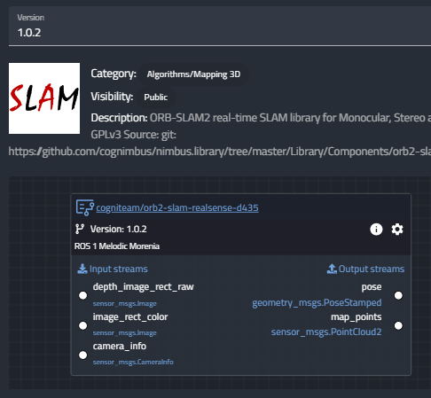

Composing a Behavioral Graph
----------------------------

When you click confirm, the component is added to the configuration
and you can compose your computational graph by connecting output
streams of one component to the input stream of another. Note that
red components represent drivers of sensors which only have output
streams, and green components represent drivers of actuators that are
able to receive input streams with instructions.

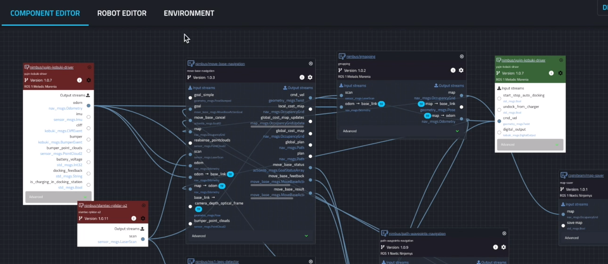

We made this large library so you can focus on your main business
core, and for everything else just plug & play read made components.
However, it is not a must. You can create your own

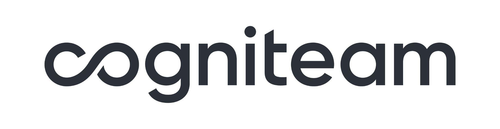

components or simply use ROS1 / ROS2 and use our platform to monitor
and control your robots.

You can deploy this version of configuration to a single robot or to
the entire fleet. You can also revert to previous versions, much like
in a version control software like GIT.

Robot Editor
------------

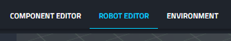

Moving to the robot editor tab of the configuration, here we can
create the digital twin of our robot, to use in our Simulation.

In a similar fashion to adding components, here we can add
**devices**, i.e., sensors and robotic platforms. Each device is a 3D
representation of some common off-the-shelf physical device you can
integrate into your robot.

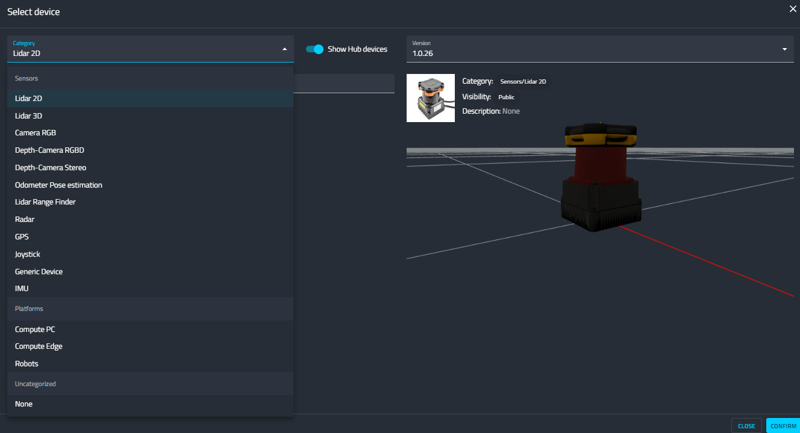

After the addition of a device you can set its 3D position on the
robot. You can also import a URDF (just drag & drop) or use our
system to build a robot and export a URDF.

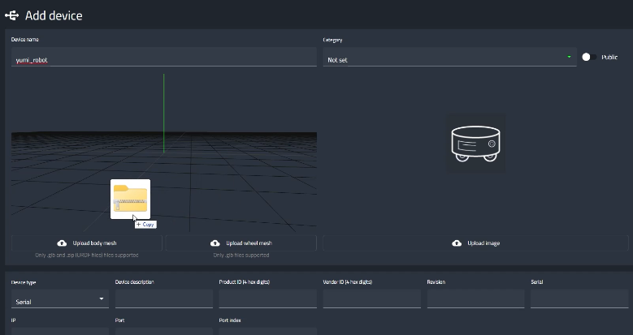

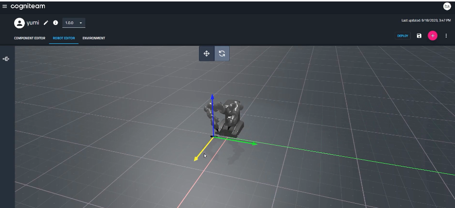

After completing creating your robot's physical twin, you are ready
to test it's behavioral configuration in the Simulation, but first,
you need to set up the environment.

Environment Tab
----------------

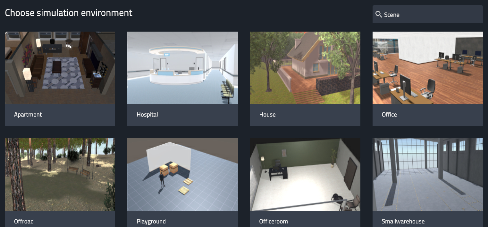

You can choose one of our many ready-made environments, or contact us
to create a project that meets your specific needs.

You can set up different scenarios in the environment by utilizing
our “dropables”. Please refer to the following video tutorial to see
how.

Now we are ready to see our robot in action in Cogniteam's Platform
Simulation.