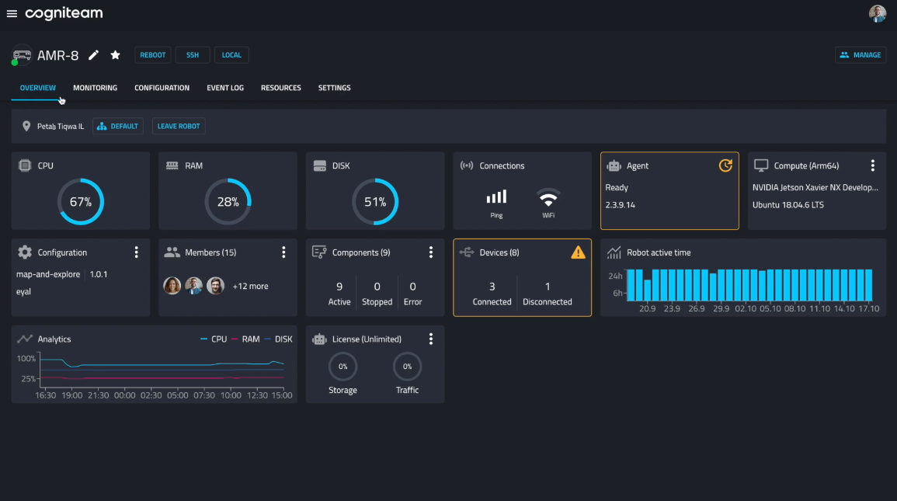

Cogniteam Cloud Platform is a cloud robotics platform that provides a
unified way to **develop**, **deploy** and **manage robots** and
**fleets**. The platform allows you to teleoperate robots, monitor &
record sensor information from anywhere in the world with one
customizable dashboard. You can monitor an individual robot or a
fleet of robots, gain remote access, and display various types of
information: data streams, performance analytics, fault diagnostics,
and more. The simulation tool provided by Cogniteam is powerful and
flexible, allowing you to create and run simulations of your robots
and their behaviors, allowing you to test and evaluate new designs,
train operators, and predict the performance of your robots under
different conditions.

Cogniteam Platform also offers a low-code development platform that
makes your ROS journey intuitive using drag-and-drop tools and a rich
set of ready-made AI algorithms such as object recognition,
navigation, and path planning that are ROS1/2 compatible. You can
easily design, develop, and test your robots, allowing you to create
custom behaviors that are tailored to your unique needs. The platform
supports ROS 1/2 by providing a bridge that allows ROS 1/2 nodes to
communicate. This enables developers to leverage the existing ROS
ecosystem, libraries, and tools while benefiting from the platform
capabilities.

See full overview video here:
https://vimeo.com/878210524

.. raw:: html 

    <iframe src="https://player.vimeo.com/video/878210524?h=54a276492f" width="640" height="564" frameborder="0" allow="autoplay; fullscreen" allowfullscreen></iframe>

Log in to the system `here <https://app.cognimbus.com/>`_

.. note::

   This documentation is under active development.

.. must add the page here in order to see it on the side menu

.. toctree::
   :hidden:
   
   
   installation-guide
   robots-tab
   robots-overview
   monitoring
   settings
