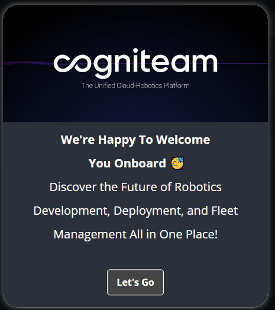
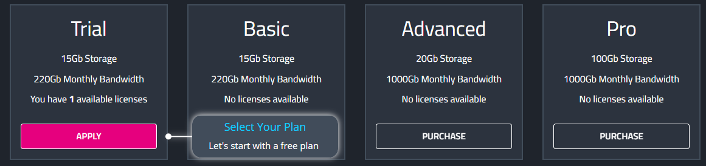
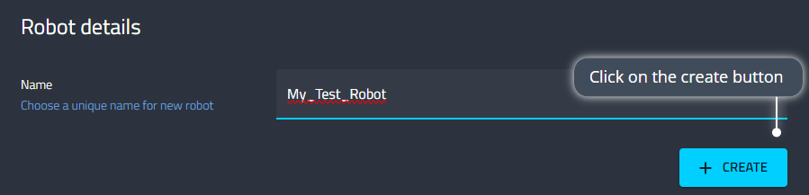
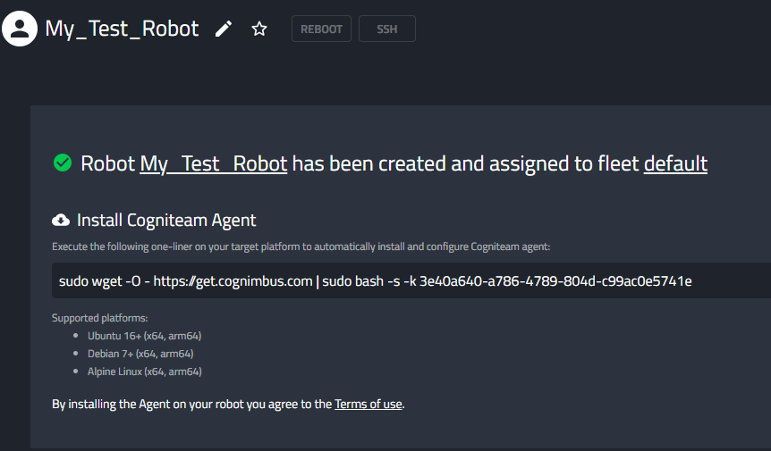
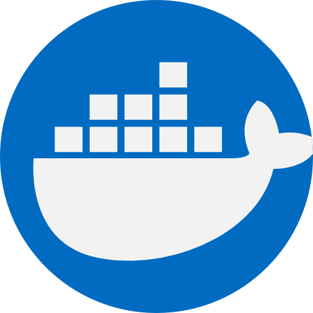
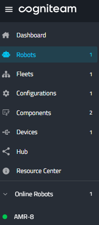
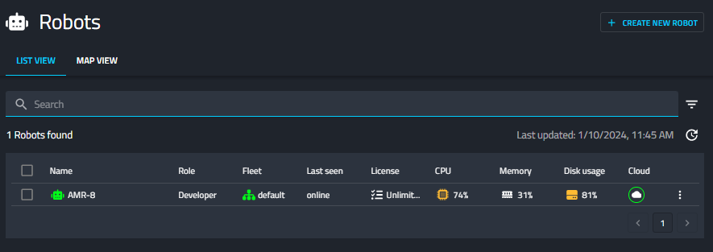

Installation guide
==================

Welcome to Cogniteam's Cloud Platform! This installation guide will walk you through the process of signing up and installing the Agent software on your robot. Follow these steps to get started:

Signe Up
--------

To unlock the full potential of Cogniteam's platform, you need to sign up or sign in. Visit our platform at 
https://app.cognimbus.com/  and follow these steps:

a. Email and Password:
 
 - Enter your email address.
 - Choose a secure password.

b. Google Account:

 - Alternatively, sign in using your Google account.

Take a moment to explore the platform with our **Guided Tour** or refer to this manual for detailed instructions.

Create a New Robot
------------------

Once signed in, initiate the creation of a new robot with these
steps:

a. Click on "Create a New Robot."

b. Select Your Plan:

- Choose the plan that best suits your requirements.

c. Name Your Robot:

 - Enter a unique and descriptive name for your robot.

d. Click on "Create":

 - Confirm your choices and initiate the creation process.

Congratulations! You have successfully signed up, created a new
robot, and customized its initial settings. The next step is to
install Cogniteam's Agent on your robot.

Installing the Agent
--------------------

The **Agent**, a pivotal component of Cogniteam's Cloud Platform,
empowers you to manage and interact with your robot from any location
globally. It facilitates the connection of robots to Cogniteam's
cloud services, handles system software and dependencies
installation, manages robot configurations, collects platform data,
monitors robot status, and enables remote control through the
Cogniteam Cloud Platform.

The Agent can either be installed directly on our supported platforms
or inside a docker.

Agent Installation

Open the terminal connected to your robot and copy-paste the command
to install the Agent

**Prerequisites**
Ensure that your robot operates on one of our supported platforms:

 - Ubuntu 16+ (x64, arm64)
 - Debian 7+ (x64, arm64)
 - Alpine Linux (x64, arm64)

**Dockerized Version**

Optionally, for a Dockerized version of the Agent, append "-docker" to the installation command. This version includes all necessary dependencies within a Docker image. Utilize the following terminal commands:

 - To start the agent use - “start_nimbus_docker”
 - To stop the agent use - “stop_nimnus_docker”
 - To update the agent use - “update_nimbus_docker”

**Note:** Updates for the Dockerized Agent can only be performed
through the provided terminal commands; Cloud Platform updates are
not currently supported.

**Installation on Windows 11 (using WSL2):**

Another option is to install the Agent on a Windows11 system by using
`Windows Subsystem for Linux (WSL2) <https://learn.microsoft.com/en-us/windows/wsl/about>`_, 
which is a feature of Windows that allows you to run a Linux environment on your Windows machine, without the need for a separate virtual machine or dual booting.

1. Use the admin powershell to install wsl2 by typing “wsl -install”
2. Configure DNS for WSL with the following commands:

.. code-block:: bash

   echo -e "[network]\ngenerateResolvConf = false" | sudo tee -a /etc/wsl.conf
   # add google DNS or replace 8.8.8.8 with a DNS provider of your choice
   sudo sed -i 's/nameserver [0-9]\+\.[0-9]\+\.[0-9]\+\.[0-9]\+/nameserver 8.8.8.8/' /etc/resolv.conf

3. Install a Docker client within WSL2 to ensure compatibility: run “docker”
4. Finally, execute the Agent installation command with "-docker" to complete the installation within the Windows 11 system

Congratulations! You have successfully installed the Cogniteam Agent,
providing seamless connectivity and control over your robot through
the Cogniteam Cloud Platform.

Post-Agent Installation: Accessing your Robot
---------------------------------------------
Upon successful installation of the Agent, you will find your robot's name prominently displayed in the navigation bar under "Online Robots," accompanied by a reassuring green dot indicating its online status.

1. Click on the "Robots" tab in the menu to access a comprehensive list of your robots.

2. Explore the Features:

 - Take advantage of the intuitive interface to manage and monitor your robots effortlessly.
 - Access detailed information about each robot, including status, configurations, and performance metrics.
 - Utilize the platform's robust features to streamline your robotic operations.

Refer to the following section for an in-depth exploration of the capabilities available within the "Robots" tab. Maximize the potential of Cogniteam's Cloud Platform to enhance your robotic experience.
