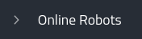

.. _`Setup new agent`:

Installation Guide
===============================

Choose your OS 

.. _`Nimbus`: index.md
.. _`Nimbus Agent`:

   .. image:: _static/img/Tux.png
      :width: 100px
      :target: #install-nimbus-agent-on-linux
      :class: hover-popout

   .. image:: _static/img/Docker.png
      :width: 100px
      :target: #install-nimbus-agent-dockerized
      :class: hover-popout

   .. image:: _static/img/Win.png
      :width: 100px
      :target: #install-nimbus-agent-in-wsl2
      :class: hover-popout

Overview
--------

To manage and interact with a robot, the Nimbus agent must be installed.

The Nimbus agent:

- Connects robots to Nimbus cloud services
- Installs Nimbus system software and dependencies
- Installs and manages robot configurations (devices and components)
- Gathers platform data and monitors robot status
- Enables robots to be controlled from Nimbus

.. _install-nimbus-agent-on-linux:

Install nimbus agent on Linux 
----------------------------

To create a new robot instance and install the Nimbus agent on your target platform (robot).

1. In the Side Bar, click |robots| then click |create_new_robot|.

2. Choose your license, and click |apply|.

   If using the Nimbus free plan, from the **Free** license panel, click **APPLY**.

   **Note** If you create more than 2 robots, a `purchased license <https://www.cognimbus.com/pricing>`_ is required.

3. Enter a unique name for your new robot.

4. To install the Nimbus agent, copy the displayed Linux command and execute it from a terminal connected to your robot.
   
   In the Navigation panel, under |online_robots|, the robot's name is listed with a green indicator. This confirms connection to Nimbus. In the |robots| tab, the |Deployed_robot_icon| icon appearing next to the robot's name also confirms that the robot is connected.
   

**Note:** To display the agent installation line, enter the command ``nimbus system link`` in the robot terminal.

Install nimbus agent dockerized
----------------------------

- Nimbus can be installed as a doker  
- Just add --docker at the end of the install script and it will install the docker container with the agent in it
- For starting the dockerized agent 
.. code-block:: bash
   :linenos:

   start_nimbus_docker

- For stopping the dockerized agent 
.. code-block:: bash
   :linenos:

   stop_nimbus_docker

- For updating the dockerized agent (updating it from the nimbus website is not supported at this stage)
.. code-block:: bash
   :linenos:

   update_nimbus_docker

.. _install-nimbus-agent-in-wsl2:

Install nimbus agent in WSL2 
----------------------------

- It is possible to install the agent on Win11 Ubuntu 22.04. 
- First install WSL2 from admin powershell using
.. code-block:: bash
   :linenos:

   wsl –install

- Docker client should be installed before running the agent install script. Make sure you are able to run inside WSL2
.. code-block:: bash
   :linenos:

   docker 

- Now create the agent just using the Linux regular installation procedure (with the --docker command)
- Please note that usb passthrough is only supported through Usbipd-win (WIP)

The Nimbus agent CLI
----------------------------

Overview

Many tasks performed from the Nimbus web graphical user interface (GUI) also can be accomplished through the Nimbus agent command line interface (CLI). The CLI is accessed from a terminal connected (directly or remotely) to the target (robot) platform"s, CPU board, after the Nimbus software is installed and a unique API key has been assigned to the Nimbus agent. This document explains the significance and use of each Nimbus agent command. For each command, one or more use examples are provided

The Nimbus agent

The Nimbus agent is installed as a remote procedure call (RPC) service on the robot platform. Whether using the Nimbus web GUI or the CLI, user interaction with robots connected to Nimbus Cloud Services is facilitated by the Nimbus agent.

The Nimbus Agent:

- Establishes connection between the platform and Nimbus cloud services
- Installs on the platform the Nimbus agent daemon and application dependencies
- Gathers platform information
- Installs component configurations
- Monitors connected device drivers and algorithms