Robot's Overview and Control
============================

On each specific robot, the first tab will be the robot's overview tab. 

General Controls
----------------

.. image:: _static/img/media/image15.png
   :width: 6.5in
   :height: 3.61528in

Starting at the top left corner you can see your robot's name. You
can rename it by clicking the pencil icon or add it to your favorites
list by clicking the star icon.

Next, there are buttons for quick and useful remote actions you can perform:
 
- Reboot - will cause the robot's operating system to reboot
- SSH - will open a tab containing an SSH terminal window from
   which you directly perform system operations on your robot.

   - Agent CLI commands (we'll explore later)
   - ROS commands
   - Any other system operation your OS allows.

- Local - The agent can open a local web server which you can
   log into in case you are stationed under the same local network. This
   local server can show you most of the features of our system that are
   relevant to this specific robot. This is useful for cases in which
   remote cloud access is unavailable - you can still perform many
   actions from your browser on your local machine. We will explore this
   interesting feature later on.

In the top right corner, you can see who else in your organization is
using the robot beside you (the circular user images). Next, you can
manage these users by clicking the Manage button. This will open a
popup window that allows you to view the users and their roles on the
robot. You can invite other members to join as well.

.. image:: _static/img/media/image16.png
   :width: 3.95833in
   :height: 3.60417in

The available roles are:
   **Operator** - Can control and view data for shared robots and view
   data from robots in fleets. They cannot rename and delete robots.
   assign or change robot configurations, or control robots assigned
   to fleets.

   **Developer** - Can assign and change robot configurations, and view data
   for shared robots and fleets. They cannot delete shared robots,
   invite other robots, or assign robots to fleets.

   **Administrator** - Can assign or change robot configurations, 
   view data, and manage permissions. They can invite additional users to 
   shared robots or fleets created by other users.

Going back to the overview page, we can see the different tabs from which we can control and monitor the robot:

.. image:: _static/img/media/image17.png
   :width: 5.45833in
   :height: 0.47917in

We are currently in the overview tab.

Overview Tab
------------

Continuing our exploration from top to bottom, we can see the robot's
location, when it was last seen (if not online), the fleet it is
assigned to, and an option to leave the robot.

The following tiles depict the general overview of this robot.

+--------------------+-----------------------------------------------------------+
| Tile               | Description                                               |
+====================+===========================================================+
|| CPU, RAM, Disk    || The robot's information as                               |
||                   || reported by the Agent                                    |
+--------------------+-----------------------------------------------------------+
|| Connections       || The strength of the WiFi                                 |
||                   || signal and the speed of the                              |
||                   || ping.                                                    |
+--------------------+-----------------------------------------------------------+
|| Agent             || Current version of the agent's                           |
||                   || software. And an upgrade                                 |
||                   || option if needed. (recall that                           |
||                   || the dockerized agent should be                           |
||                   || upgraded manually)                                       |
+--------------------+-----------------------------------------------------------+
|| Compute           || Allows you to view your system                           |
||                   || details: CPU architecture, OS,                           |
||                   || computer Type and vendor (if                             |
||                   || available)                                               |
+--------------------+-----------------------------------------------------------+
|| Configuration     || This is a shortcut popup window for managing the robot's |
||                   || configuration, as we shall                               |
||                   || explore later on. For now,                               |
||                   || imagine it as the GIT to your                            |
||                   || robot's structural and                                   |
||                   || behavioral configuration, from                           |
||                   || which you can view history,                              |
||                   || edit, or deploy new                                       |
||                   || configurations. See the image                            |
||                   || below the table.                                         |
+--------------------+-----------------------------------------------------------+
|| Members           || This opens the same popup                                |
||                   || window as the manage button in                           |
||                   || the top right corner,                                    |
||                   || discussed earlier.                                       |
+--------------------+-----------------------------------------------------------+
|| Components        || A list of installed docker                               |
||                   || containers the robot is running /                        |
||                   || able to run. We'll explore this                          |
||                   || feature later on, but for now,                           |
||                   || consider that you can                            |
||                   || run different dockerized                                 |
||                   || drivers and algorithms on your                           |
||                   || robot. Clicking in this tile                             |
||                   || will open a popup window which                           |
||                   || allows you to view and control                           |
||                   || these components. See the image below.                   |
+--------------------+-----------------------------------------------------------+
|| Devices           || Your robot is comprised of                               |
||                   || several different devices,                               |
||                   || e.g., LIDARs and Cameras,                                |
||                   || which are connected via                                  |
||                   || different ports. Clicking on                             |
||                   || this tile allows you to view                             |
||                   || these ports. See the image below.                        |
+--------------------+-----------------------------------------------------------+
|| Robot Active Time || A chart depicting for each day                           |
||                   || how many hours the robot was                             |
||                   || active - i.e., powered up.                               |
+--------------------+-----------------------------------------------------------+
|| License           || Your current License, and your                           |
||                   || current use of cloud Storage                             |
||                   || and Traffic. You can click on                            |
||                   || the tile and upgrade your                                |
||                   || license.                                                 |
+--------------------+-----------------------------------------------------------+
|| Analytics         || Displays your robot's CPU,                               |
||                   || RAM, and disk usage across                               |
||                   || time.                                                    |
+--------------------+-----------------------------------------------------------+

.. image:: _static/img/media/image18.png
   :width: 4.05278in
   :height: 3.41667in

The above image depicts the Configuration popup window. You can see
the current name and version of the installed configuration. You can
search for other configurations and choose to deploy on a single or
multiple robots. You can also view the history of deployed
configurations.

But wait! What is a Configuration?!

We'll get to that soon enough when exploring the configuration tab.
For now, it is enough to know that a configuration has 2 coupled
definitions. 1) the 3D structure of the robot, 2) the robot,
and 3) the behavioral graph of the robot - interconnected drivers 
and algorithms depicting the sense-think-act cycle of the robot.

.. image:: _static/img/media/image19.png
   :width: 4.41667in
   :height: 4.58333in

These drivers and algorithms are dockerized processes which we call
“components”. The above image depicts the components popup window,
which allows you to start/stop/restart these processes. It is
particularly useful when just a single component requires a restart,
e.g., the camera stopped working and we wish to reset it before
debugging why.

.. image:: _static/img/media/image20.png
   :width: 6.5in
   :height: 1.78056in

The Devices popup window allows you to view the details of your
robot's ports and what is connected to these ports.

Now, let's jump over to the Monitoring tab, and see what we can do.

Monitoring & Teleoperation Tab
==============================

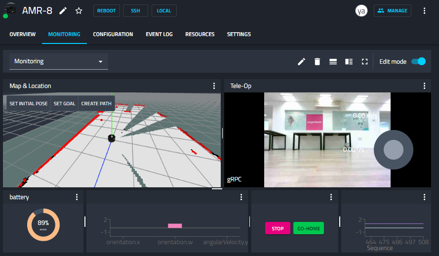

This tab allows you to configure a dashboard that displays multiple views that monitor or control the robot. You can store and load different presets according to user specific needs or taste. When starting fresh, you have one view. You can assign a viewer to this view by clicking the button “add viewer”. You can also use the 3-dot menu to split the view vertically or horizontally and add other views until you are satisfied with the dashboard you have created. You can name your dashboard preset by clicking the pencil icon, or choose an existing preset from the dropdown menu on the left.

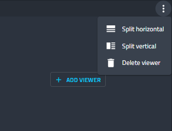

When adding a viewer a popup window will appear, allowing you to
select the desired view type and the robot streams that serve as the
input for this view. Each tile depicts a different viewer type.
Clicking the tile will lead the table below to show the available
streams this viewer can display. These streams are either ROS1/2
streams (Topics) that natively run on your robot, or streams
available via the components (dockerized processes) you have
installed though Cogniteams Cloud Platform.

Let's go through each type of viewer.

Viewer Types
------------

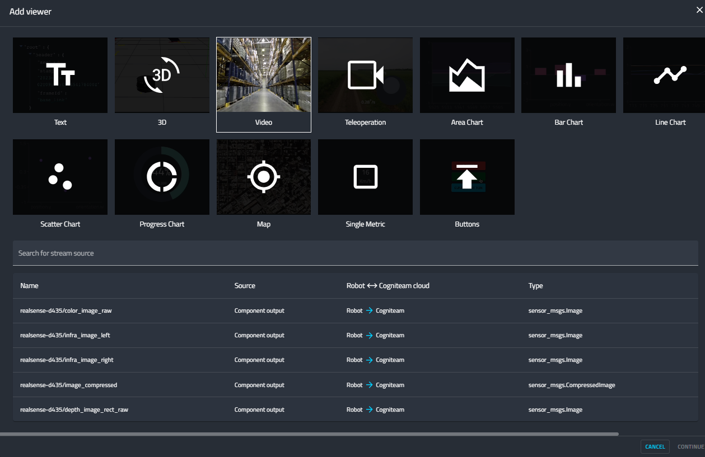

Let's review each viewer:

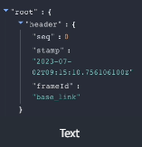

Any String / JSON / Numerical output can be displayed in a text format. This is particularly useful for development or debugging processes.

.. image:: _static/img/media/image25.png
   :width: 1.63472in
   :height: 1.69861in

Any stream of 3D data can be displayed, and also layered on top of a map view. This view is particularly useful for displaying the MAP a SLAM process is creating, and to overlay streams such as LIDAR, Point-Cloud, and any other ROS-based Markers available in tools such as RVIZ. 
In addition to viewing the different 3D streams, this viewer also allows you to send navigation commands to the robot. We'll explore these features next.

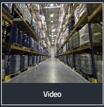

Use this viewer to display any camera views such as raw streams, compressed streams, left and right views of a stereoscopic camera etc.
You are also able to select the protocol (e.g., WebRTC) and other display configurations to make your viewing experience as smooth as needed for your operations.
As an operator, this type of view is very useful to investigate what the robot is facing.

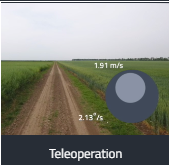

Similarly to the video viewer, this viewer can display video streams. However, this viewer is also equipped with a virtual joystick, through which you can remotely control the movement of your robot.
You can configure the movement model (e.g., Ackermann / Twist) and assign the robot's input stream that receives these commands.

Data charts:
Area, Bar, Line, Scatter, and Progress Bar

Use the desired chart type to display any data stream you wish your robot to output. It is particularly useful for displaying different ad-hoc KPIs or analytical data your robot collects.

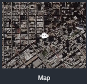

If your robot carries a GPS or other means of reporting its global location then you can use this viewer to display where your robot is located on the global map.

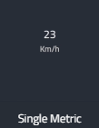

Any particular measurement you would like to display? Whether its speed, acceleration, heading, battery, or any other single value you wish to monitor - this is the viewer for you.

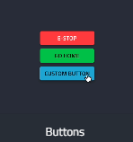

Last but not least is the Buttons viewer in which you can create as many buttons as you wish, and assign each one a different command to be written to a ROS topic. 
This is particularly useful for emergency stops, going to a certain location such as the charging station, etc.
Assign useful commands that are just one click away. 

Each viewer can be configured by selecting the “settings” option in
the 3-dot menu in the top right corner of the view.

Let's go through the different configurations.

**Configuring the Text Viewer**

This is a simple viewer. As such you can only configure the title of the viewer.

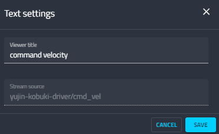

This option is available in every viewer settings.

**Configuring the 3D Viewer**

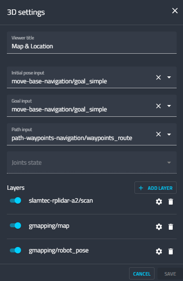

As mentioned above, this viewer allows you to overlay different layers (e.g., LIDAR, Point-Cloud) on top of a SLAM produced map, and also to send navigation commands to the robot by selecting waypoints across the map.

You can define:

- the stream from which the initial position will be taken as an input. 
- The stream to which goals are sent
- The stream to which waypoints are sent as a route
- Layers you wish to display on top of the map
  
  - Use the “add layer” button to add new layers
  - You can select one from the list of available layers that will be displayed in a popup window.

You can edit each layer:

- Choose to display it or not using the toggle slider
- Delete it by clicking the trashcan icon
- Edit the layer's settings by clicking the gear icon

  - Sometimes you need to define the stream from which a map offset can be read. 
  - This offset is used to align the layer with the map.
  - Note: In the near future, Cogniteam will support ROS TFs 

You can use the top buttons to set an initial position, a new goal or a path. Simply click on the map where you want the robot to go.

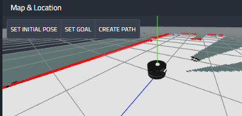

**Configuring the Video Viewer**

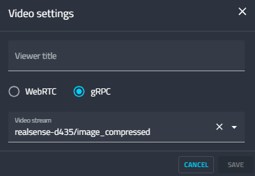

Currently, our platform supports 2 different protocols you can select to display your video feed: WebRTC and gRPC.
You can read more about these protocols and how they may affect your experience with the robot in our blog post `here <https://cogniteam.com/cloud-based-teleoperation-in-robotics/>`_.

**Configuring the Teleoperation Viewer**

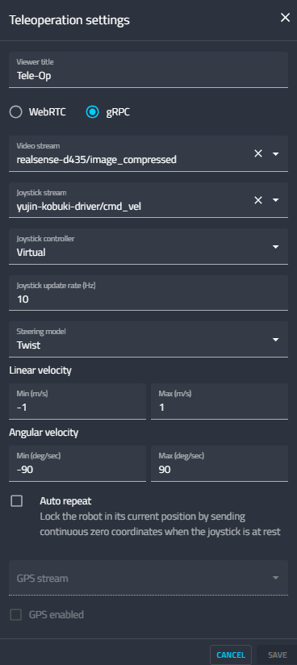

The Teleoperation viewer configuration also allows you to choose between WebRTC and gRPC protocols. However it also allows you to configure how the joystick should control the movement of your robot.

You can choose the following:
- video feed just as in the video viewer.
- the joystick stream to which the movement of the virtual joystick will be written. 
- The frequency (Hz) joystick commands will be sent
- The steering model - Twist or Ackermann
- Linear and angular velocity parameters.

Check the “auto repeat” checkbox to lock the robot in its place by sending a continuous stream of 0s.
Additionally, if your robot possesses a GPS you can set the GPS stream from which the location of the robot will be read.

**Configuring a Chart Viewer or a Single Metric**

All the charts are defined with a stream source, MIN and MAX values, and the data variables to display in the chart.

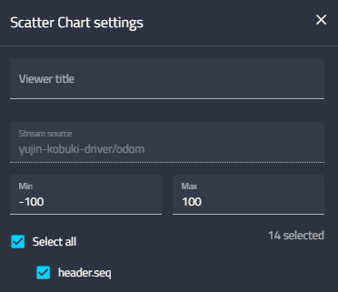

**Configuring the Buttons Viewer**

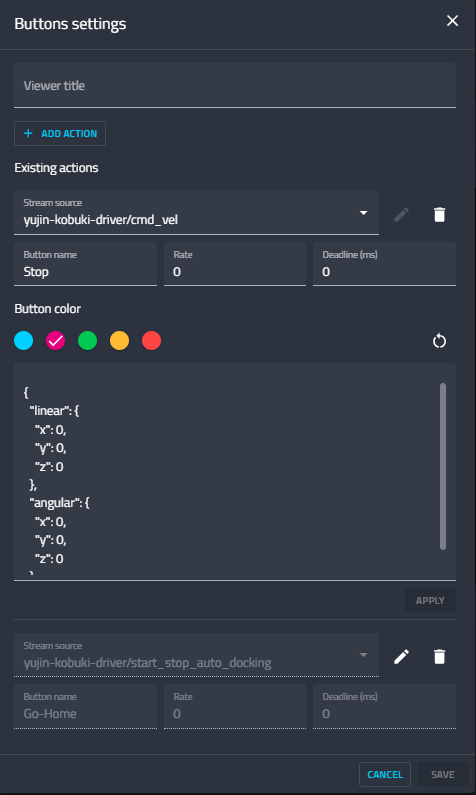

Add buttons by clicking the “Add Action” button
choose the 
- stream source the receives the button command
- The name of the button
- The rate in which the command is sent
- The Deadline (ms) after which the command is aborted
- The color of the button
- The text to be written to the stream upon clicking the button

Settings
========

Specific robot settings are found in the robot page under the settings tab

General Settings
----------------

In the **General Settings** frame you can tick the following
checkboxes:

**Synchronize configuration**
On restart pull the latest configuration version from the cloud and
update the robot. As you may recall, a configuration is the
behavioral graph that we promised to discuss later, and we will. If
you check this option, and indeed used our low-code configuration,
then whenever the robot restarts, it automatically checks if it has
the most updated version of its configuration, and downloads and
deploys it automatically if needed.

Cloud Provider
--------------

Next you can select a cloud provider. You can either choose Cogniteam's Cloud and let us take care of all the configurations, OR provide the necessary details for your AWS - S3 Cloud to store the information there.

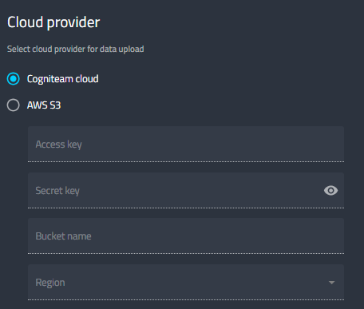

Notification Rules
------------------
Next you can set up the Notification rules.

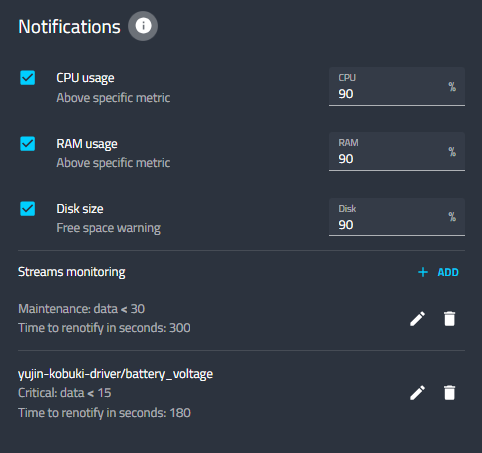

How do the notifications work?
- Notification will be sent every time the value crossed the threshold
- Re-notification will be sent as long as the value persists for over 160 min above the threshold
- Re-notifications will be sent no more than 3 times
- For built-in notifications (CPU, RAM, Disk) the value has to persist for at least 10 seconds

Beside defining the threshold for CPU/ RAM/ Disk related notifications, you can set up stream monitoring rules.
Simply choose a stream source, a data field within this source, a conditional operator and a threshold value.
That's it. A notification will be sent whenever that threshold is crossed.

Log and Analytics
-----------------

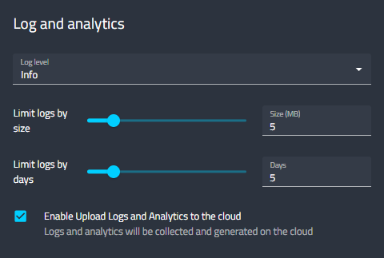

You can choose the Log Level:

+-----------------------------------+-----------------------------------+
|    **Log Level**                  |    **Description**                |
+===================================+===================================+
|    Trace                          |    The TRACE log level is used to |
|                                   |    provide the most detailed and  |
|                                   |    fine-grained information about |
|                                   |    the execution flow of a        |
|                                   |    program, often used for        |
|                                   |    troubleshooting and debugging  |
|                                   |    purposes                       |
+-----------------------------------+-----------------------------------+
|    Debug                          |    DEBUG log level is utilized to |
|                                   |    output detailed information    |
|                                   |    that is helpful for debugging, |
|                                   |    typically providing insights   |
|                                   |    into the internal workings of  |
|                                   |    the software, but not          |
|                                   |    necessary for regular          |
|                                   |    operation.                     |
+-----------------------------------+-----------------------------------+
|    Info (default)                 |    INFO log level is used to      |
|                                   |    convey general, high-level     |
|                                   |    information about the          |
|                                   |    application's state or         |
|                                   |    important events, helping      |
|                                   |    users understand the system's  |
|                                   |    overall behavior.              |
+-----------------------------------+-----------------------------------+
|    Warning                        |    WARNING log level indicates    |
|                                   |    potential issues or situations |
|                                   |    that may lead to problems in   |
|                                   |    the future but do not          |
|                                   |    necessarily disrupt the        |
|                                   |    current operation. It serves   |
|                                   |    as a cautionary level.         |
+-----------------------------------+-----------------------------------+
|    Error                          |    ERROR log level signifies the  |
|                                   |    occurrence of a significant    |
|                                   |    problem or error during the    |
|                                   |    execution of the program,      |
|                                   |    indicating a failure in a      |
|                                   |    specific operation or          |
|                                   |    functionality. It usually      |
|                                   |    requires attention to address  |
|                                   |    and resolve the issue.         |
+-----------------------------------+-----------------------------------+

Use the sliders to limit the log file size (MB) and by days. You can
check the checkbox to enable the automatic upload of the collected
logs and analytics files to the cloud when the robot is online.

Docker Registry
---------------

You can set up the URL of your docker registry here.

Finally you can click on the “save changes” button at the bottom of
the screen to set any changes.

Next we are going to explore what are Cogniteam-Platform's Components
and configurations.
