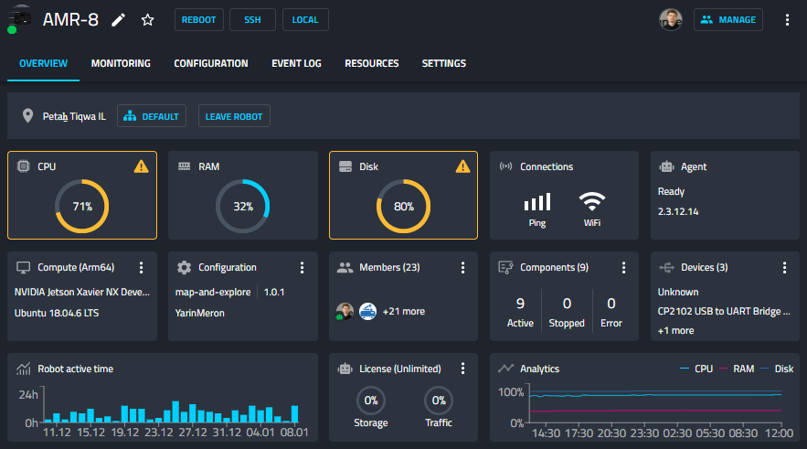
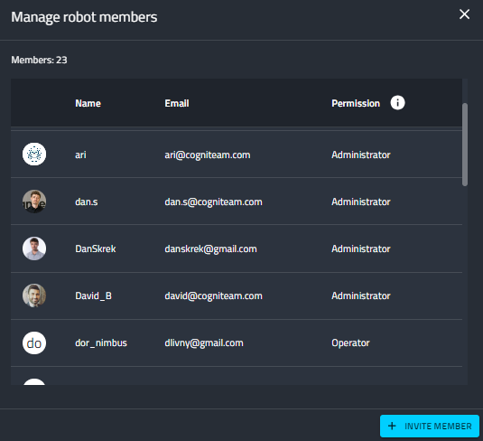
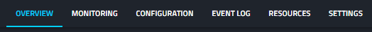
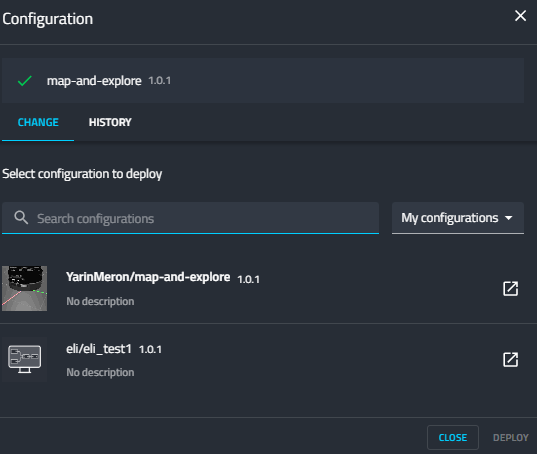
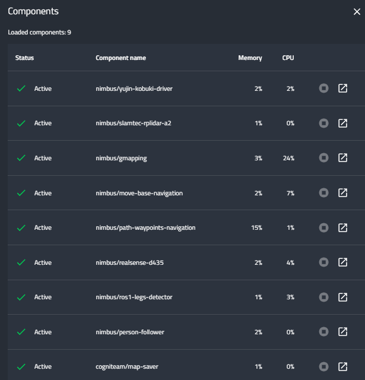
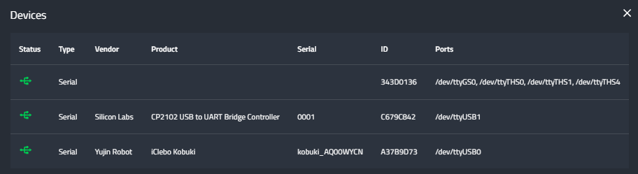

Robot's Overview and Control
============================

You have clicked on a specific robot and now you are looking at the
robot's overview tab. Let's explore this page from top to bottom.

General Controls
----------------

Starting at the top left corner you can see your robot's name. You
can rename it by clicking the pencil icon or add it to your favorites
list by clicking the star icon.

Next , there are buttons for quick and useful remote actions you can perform:
 
- Reboot - will cause the robot's operating system to reboot
- SSH - will open a tab containing an SSH terminal window from
   which you can directly perform system operations on your robot.

   - Agent CLI commands (we'll explore later)
   - ROS commands
   - Any other system operation your OS allows.

- Local - The agent is able to open a local web server which you can
   log into in case you are stationed under the same local network. This
   local server can show you most of the features of our system that are
   relevant for this specific robot. This is useful for cases in which
   remote cloud access is unavailable - you can still perform many
   actions from your browser on your local machine. We will explore this
   interesting feature later on.

In the top right corner you can see who else in your organization is
using the robot beside you (the circular user images). Next, you can
manage these users by clicking the Manage button. This will open a
popup window which allows you to view the users and their role on the
robot. You can invite other members to join as well.

The available roles are:
   **Operator** - Can control and view data for shared robots and view
   data from robots in fleets. They cannot rename and delete robots.
   assign or change robot configurations, or control robots assigned
   to fleets.

   **Developer** - Can assign and change robot configurations, view data
   for shared robots and fleets. They cannot delete shared robots,
   invite other robots, or assign robots to fleets.

   **Administrator** - Can assign or change robot configurations, 
   view data and manage permissions. They can invite additional users to 
   shared robots or fleets created by other users.

Going back to the overview page, we can see the different tabs from which we can control and monitor the robot:

We are currently in the overview tab. Let's explore its features in the next.

Overview Tab
------------

Continuing our exploration from top to bottom, we can see the robot's
location, when it was last seen (if not online), the fleet it is
assigned to, and an option to leave the robot.

The following tiles depict the general overview of this robot.

+--------------------+-----------------------------------------------------------+
| Tile               | Description                                               |
+====================+===========================================================+
|| CPU, RAM, Disk    || The robot's information as                               |
||                   || reported by the Agent                                    |
+--------------------+-----------------------------------------------------------+
|| Connections       || The strength of the WiFi                                 |
||                   || signal and the speed of the                              |
||                   || ping.                                                    |
+--------------------+-----------------------------------------------------------+
|| Agent             || Current version of the agent's                           |
||                   || software. And an upgrade                                 |
||                   || option if needed. (recall that                           |
||                   || the dockerized agent should be                           |
||                   || upgraded manually)                                       |
+--------------------+-----------------------------------------------------------+
|| Compute           || Allows you to view your system                           |
||                   || details: CPU architecture, OS,                           |
||                   || computer Type and vendor (if                             |
||                   || available)                                               |
+--------------------+-----------------------------------------------------------+
|| Configuration     || This is a shortcut popup window for managing the robot's |
||                   || configuration, as we shall                               |
||                   || explore later on. For now,                               |
||                   || imagine it as the GIT to your                            |
||                   || robot's structural and                                   |
||                   || behavioral configuration, from                           |
||                   || which you can view history,                              |
||                   || edit,or deploy new                                       |
||                   || configurations. See the image                            |
||                   || below the table.                                         |
+--------------------+-----------------------------------------------------------+
|| Members           || This opens the same popup                                |
||                   || window as the manage button in                           |
||                   || the top right corner,                                    |
||                   || discussed earlier.                                       |
+--------------------+-----------------------------------------------------------+
|| Components        || A list of installed docker                               |
||                   || containers the robot is running /                        |
||                   || able to run. We'll explore this                          |
||                   || feature later on, but for now,                           |
||                   || consider that you are able to                            |
||                   || run different dockerized                                 |
||                   || drivers and algorithms on your                           |
||                   || robot. Clicking in this tile                             |
||                   || will open a popup window which                           |
||                   || allows you to view and control                           |
||                   || these components. See the image below.                   |
+--------------------+-----------------------------------------------------------+
|| Devices           || Your robot is comprised of                               |
||                   || several different devices,                               |
||                   || e.g., LIDARs and Cameras,                                |
||                   || which are connected via                                  |
||                   || different ports. Clicking on                             |
||                   || this tile allows you to view                             |
||                   || these ports. See image below.                            |
+--------------------+-----------------------------------------------------------+
|| Robot Active Time || A chart depicting for each day                           |
||                   || how many hours the robot was                             |
||                   || active - i.e., powered up.                               |
+--------------------+-----------------------------------------------------------+
|| License           || Your current License, and your                           |
||                   || current use of cloud Storage                             |
||                   || and Traffic. You can click on                            |
||                   || the tile and upgrade your                                |
||                   || license.                                                 |
+--------------------+-----------------------------------------------------------+
|| Analytics         || Displays your robot's CPU,                               |
||                   || RAM, and disk usage across                               |
||                   || time.                                                    |
+--------------------+-----------------------------------------------------------+

The above image depicts the Configuration popup window. You can see
the current name and version of the installed configuration. You can
search for other configurations and choose to deploy on a single or
multiple robots. You can also view the history of deployed
configurations.

But wait! What is a Configuration?!

We'll get to that soon enough when exploring the configuration tab.
For now, it is enough to know that a configuration has 2 coupled
definitions. 1) the 3D structure of the robot, and 2) of the robot,
and 2) the behavioral graph of the robot - interconnected drivers 
and algorithms depicting the sense-think-act cycle of the robot.

These drivers and algorithms are dockerized processes which we call
“components”. The above image depicts the components popup window,
which allows you to start / stop / restart these processes. It is
particularly useful when just a single component requires a restart,
e.g., the camera stopped working and we wish to reset it before
debugging why.

The Devices popup window allows you to view the details of your
robot's ports and what is connected to these ports.

Now, let's jump over to the Monitoring tab, and see what we can do.

