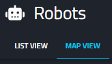
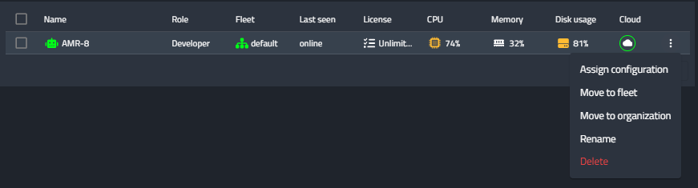

Robots Table
==========

This page enbale to to list all your robots. You can toggle between a “List View” and a “Map View”.
Use the top left “CREATE NEW ROBOT” button to add new robots - in the same way you applied 
earlier. When you'll have many robots, use the search bar to find 
any specific robots you are looking for. 

In the Map View you can see where your robots are located on top of a google map service - according to their last reported location.
Use the List view to see additional information about these robots.
The robots appear in the table below. Each robot displays the following general information:

+-----------------------------------+-----------------------------------+
|    info                           |    description                    |
+===================================+===================================+
|    Name                           |    The name you chose for the     |
|                                   |    robot                          |
+-----------------------------------+-----------------------------------+
|    Role                           |    Your assigned role on this     |
|                                   |    robot. It can either be an     |
|                                   |    operator, a developer, or an   |
|                                   |    administrator (we'll explore   |
|                                   |    it later).                     |
+-----------------------------------+-----------------------------------+
|    Fleet                          |    Which fleet the robot is       |
|                                   |    currently assigned to. By      |
|                                   |    default, you already have a    |
|                                   |    “default fleet” your robot is  |
|                                   |    assigned to.                   |
+-----------------------------------+-----------------------------------+
|    Last Seen                      |    “Online” if the robot is       |
|                                   |    currently online, or the last  |
|                                   |    time and date it appeared      |
|                                   |    connected to the Cogniteam     |
|                                   |    Cloud Platform                 |
+-----------------------------------+-----------------------------------+
|    License                        |    The license you chose for this |
|                                   |    robot.                         |
+-----------------------------------+-----------------------------------+
|    General Information            |    Current usage of CPU, Memory,  |
|                                   |    Disk, and Cloud resources.     |
+-----------------------------------+-----------------------------------+
|    3 dot menu                     |    This allows a shortcut for     |
|                                   |    applying common actions such   |
|                                   |    as assigning a configuration   |
|                                   |    (which we'll discuss later),   |
|                                   |    moving the robot to another    |
|                                   |    fleet or organization,         |
|                                   |    renaming the robot or delete   |
|                                   |    it.                            |
+-----------------------------------+-----------------------------------+

Clicking on a robot from the list will transfer you to the page of
this specific robot, which we'll explore in the next chapter.
