Simulation
==========

Cogniteam's Platform Simulation is designed to enable you to test
your robot behavioral configurations, without consuming cloud
resources. The Simulation is Unity-based and runs on your browser
(client side). The simulation communicates with Cogniteam's Agent,
whether it is deployed on your development PC for your convenience or
on your robot to test in a hardware-in-the-loop fashion. The virtual
environment feeds the robot sensor streams, the configuration serves
as the decision maker, and robot actions are applied in the virtual
environment, completing the sense-think-act cycle of the robot.

Let's explore the different features of the Simulation and how to use
them.

This is an overview of the Simulation Screen

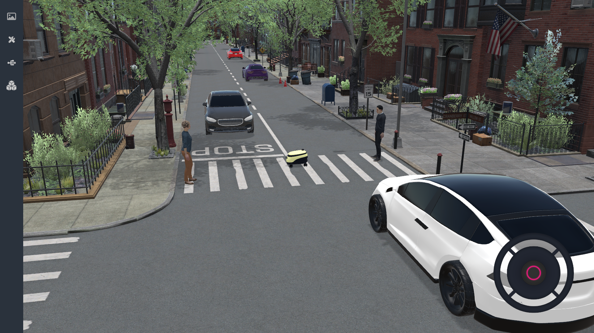

Let's explore the menu on the left.

Tools Tab
----------

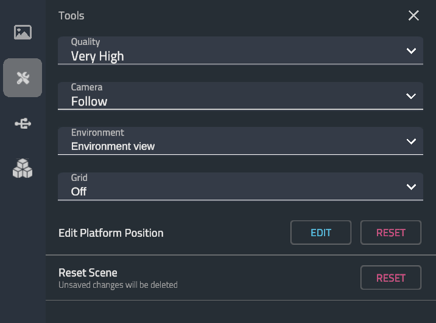

Inside the Tools tab you can change the quality level of the Simulation to match your PC or robot's hardware capabilities.

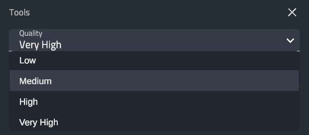

You can switch between Camera modes, the camera can follow the robot or you can switch to Free roaming / Top down view.

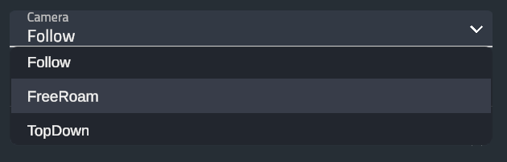

You can switch the rendering mode of the scene to **Data Mode**.
There you can see the data of the sensor instead of the 3D rendering.
This is particularly useful for seeing what the robot“sees” during
development / debug.

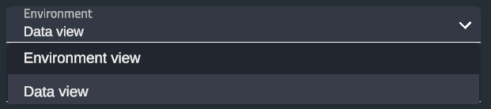

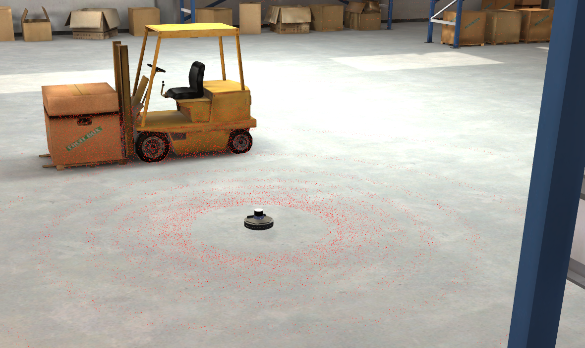

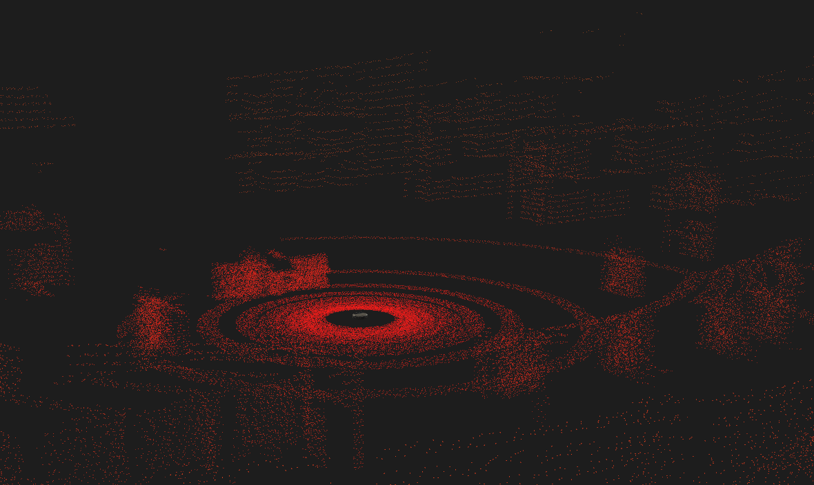

You can place a grid on the environment's ground / floor. This is
particularly useful for measuring sizes of items, different distances
and movements of the robot while debugging.

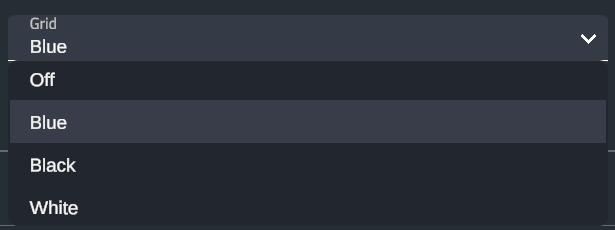

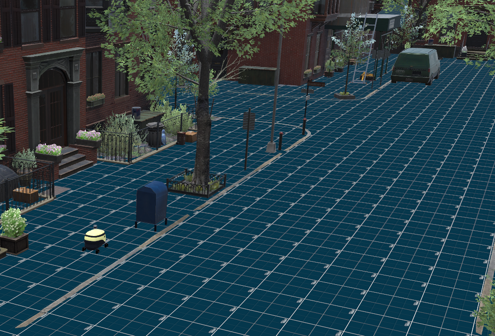

You can manually edit the position of the robot. Click on the edit button next to the “Edit Platform Position” and just point where you want the robot to be

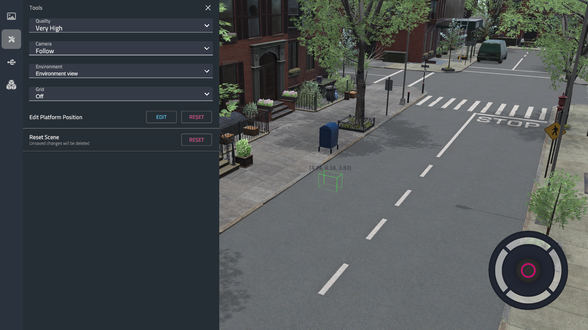

Or you can reset the scene to its starting position by clicking the
Reset button next to the “Reset Scene”.

Devices Tab
-----------
In the Devices tab you can view information about the robot and sensors and modify settings regarding the outgoing streams.

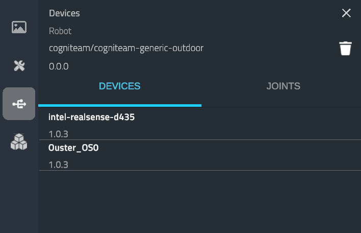

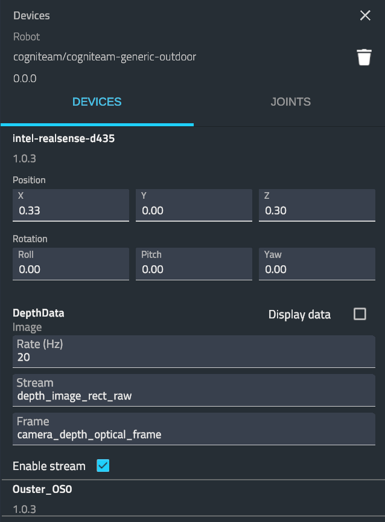

You can:

- view and edit the position and orientation of the sensor.
- change the Rate of stream and the stream name.
- enable or disable the output of a stream.
- Monitor a stream from the simulation by checking the “Display Data” checkbox.

  - You can also do it from the monitoring tab while the robot is in simulation mod

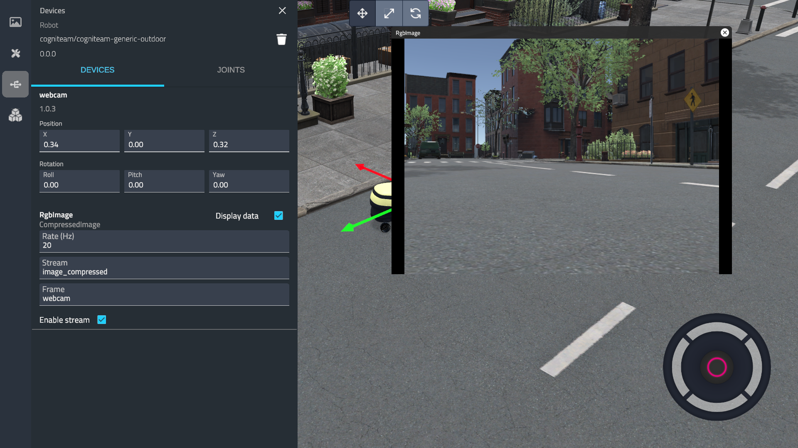
 

Inventory Tab
--------------

You can add to the scene different items that we call “dropables”. These items can be static, e.g., a box, or dynamic, e.g., a person walking. You can choose (static or dynamic) items from our rich Inventory menu and edit their behavior. Just Choose an Item and place it in the environment anywhere you want.

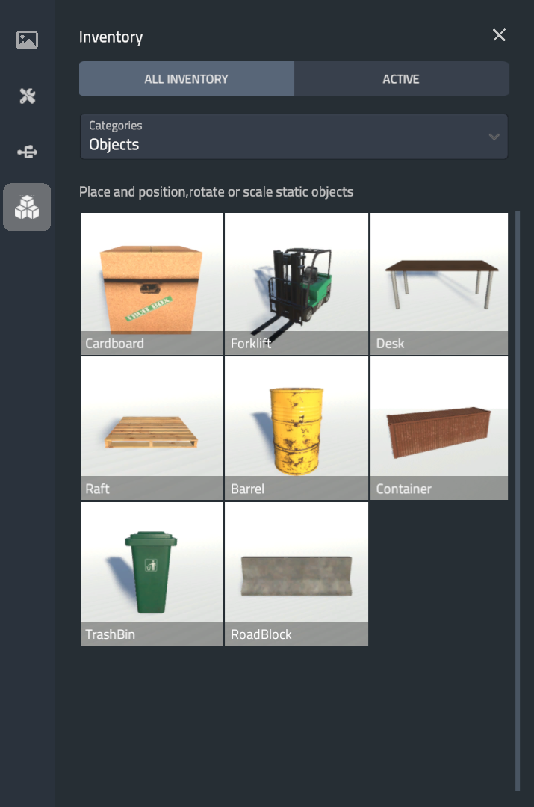

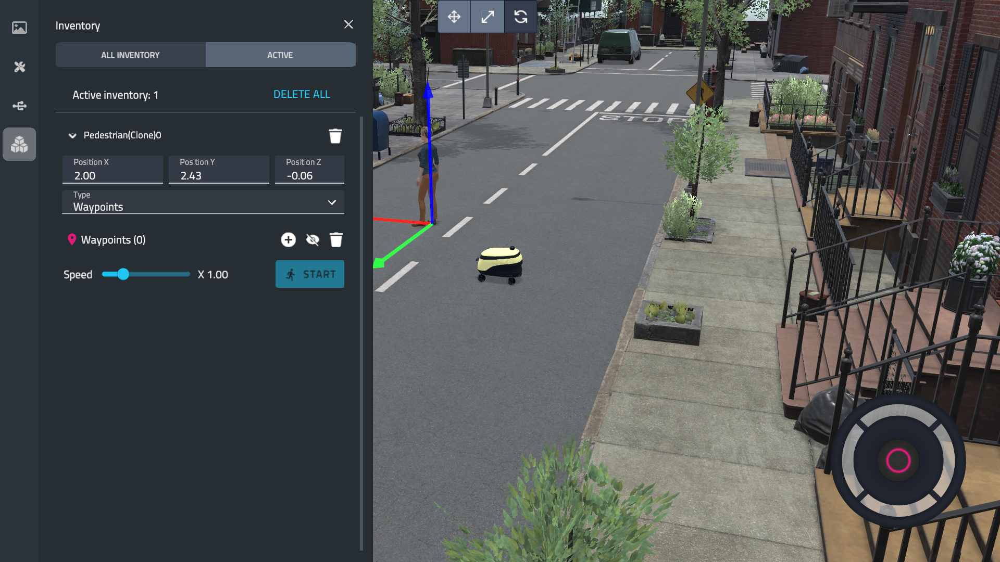

For dynamic objects, you can also select the type of movement logic
you want between“Waypoints”, “Flow” or “Wander”. For instance, if we
choose the “Waypoints“ logic, we can set up points for a person to
travel.

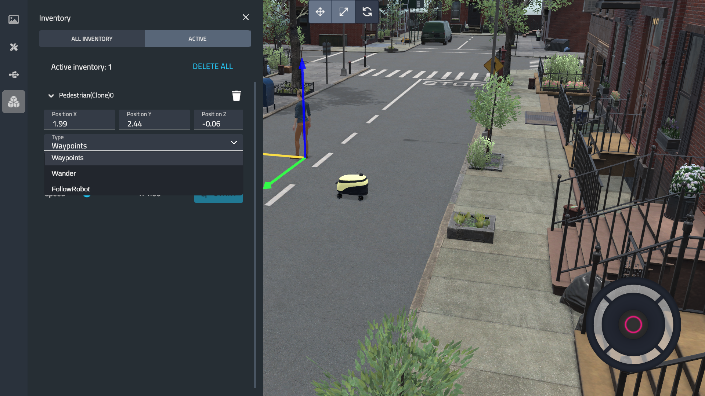

.. image:: _static/img/media/image72.png
    :width: 3.875in
    :height: 2.375in

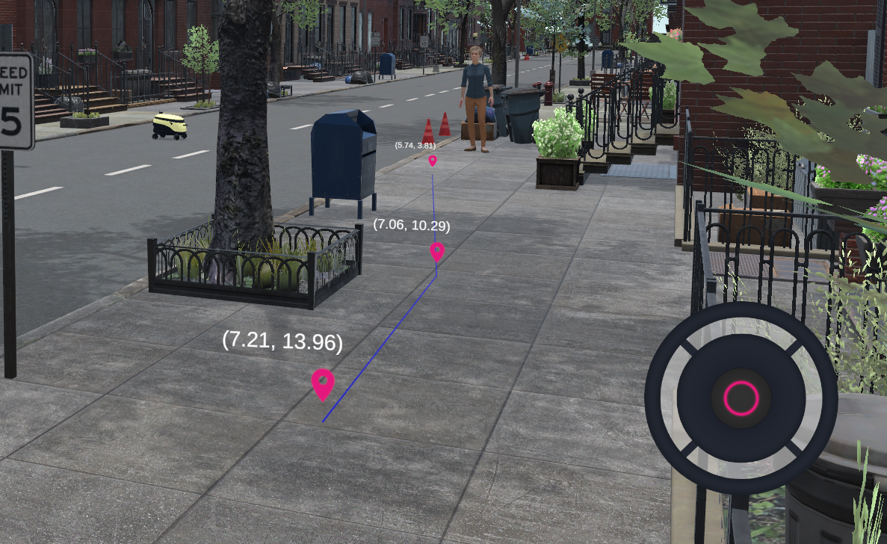

You can edit the speed of the person and start by clicking the
“Start” button.

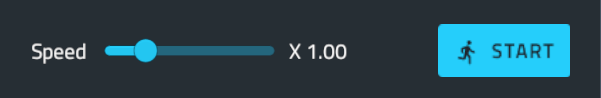

Another example, you can set up a static item and edit its mass:

.. image:: _static/img/media/image75.png
    :width: 4.00972in
    :height: 2.25in

Don't forget to save your modified configuration by clicking the save
icon. Now you can click the Simulate button to start your simulation.

In the popup window you'll need to input the PC / Robot IP.

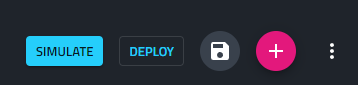

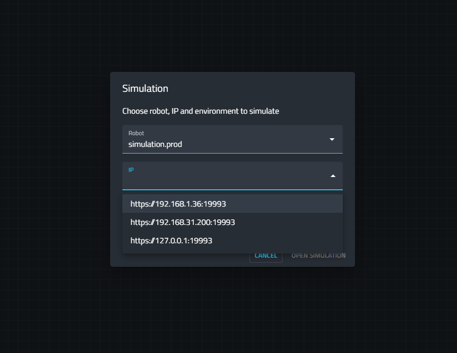

You can choose a specific scene to start the simulation.

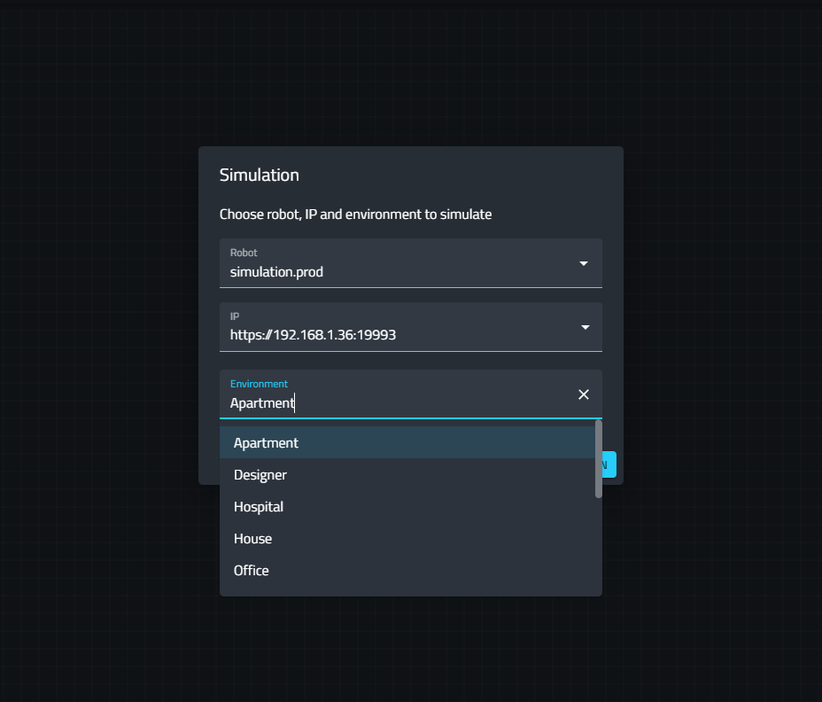

A new tab will open displaying a connection between your robot/pc and
the simulation.

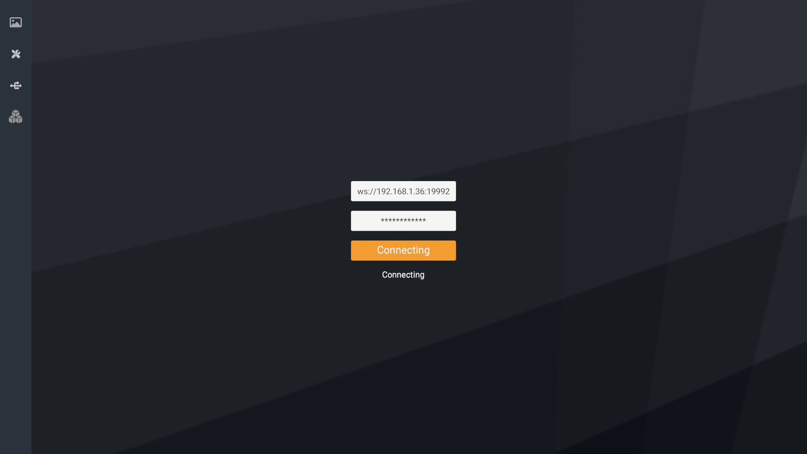

Have fun!
